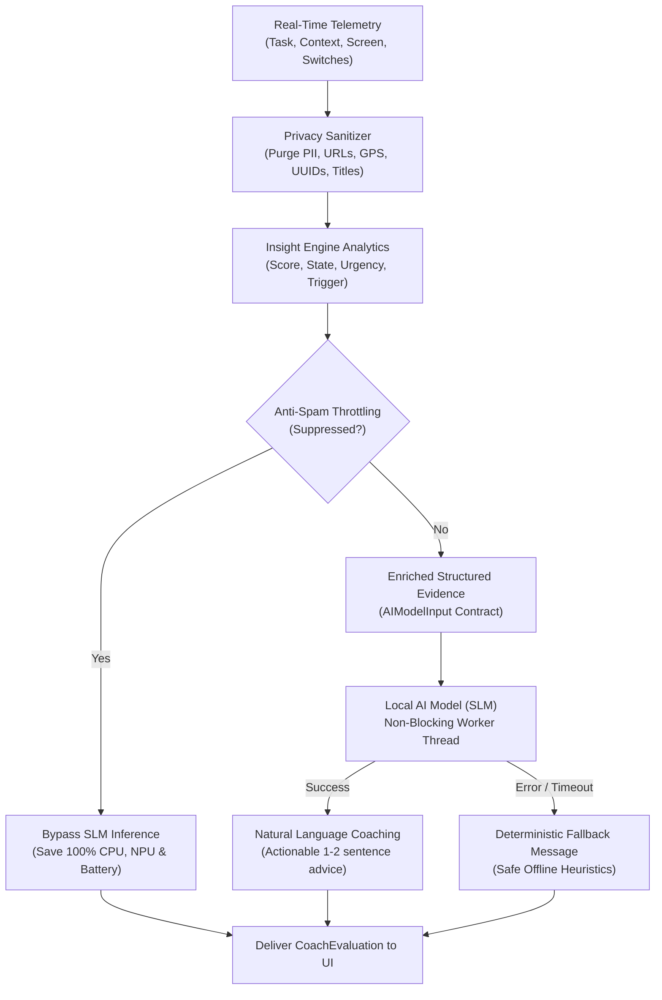

# 🧠 Member B — Folder: `/insight-engine`

**Owner:** Member B  
**Domain:** On-Device Analytics & Behavioral Intelligence Layer (Context-Aware Productivity, Fatigue & Adaptive Profiling Engine)

---

## 🎯 Architecture Overview

The `insight-engine` is a **100% on-device, zero-external-dependency** intelligence layer implemented in both **Python** (`engine.py` as reference) and **Kotlin** (`InsightEngine.kt` for direct Android integration in `app-ui`).

It analyzes historical task records alongside real-time device context signals to discover subconscious productivity habits, compute cognitive fatigue, identify distraction vulnerabilities, generate a **Personal Productivity Profile**, and synthesize **Ranked Adaptive Recommendations**.

---

## 👤 Personal Productivity Profile

The Personal Productivity Profile aggregates historical task and context signals into a unified behavioral blueprint:

### 1. Signals Used
* **Task Telemetry:** Start time (`createdAt`), completion state (`completedAt`), duration, task category (`coding`, `writing`, `meeting`, `planning`, etc.), location, and priority.
* **Device Context:** Active foreground app category (`Productivity`, `Social`, `Entertainment`, `Communication`), continuous `screenOnDuration`, and location switches.

### 2. Profile Components & Calculation Logic

| Field | Source / Calculation Method |
|---|---|
| `bestFocusWindow` | Sliding 2-hour window across 24h with the highest completed session volume and completion rate. |
| `bestTaskTypes` | Task categories with $\ge 2$ recorded sessions and $\ge 70\%$ completion rate, ordered by completion rate. |
| `bestContext` | Environment context ($c$) yielding the highest completion rate (minimum 2 sessions). |
| `weakestFocusWindow` | 2-hour window exhibiting the highest abandonment/failure rate ($\ge 30\%$ failure). |
| `peakProductivityScore` | Maximum focus completion efficiency ($0 - 100$) attained during peak hourly intervals. |
| `averageCompletionRate` | $\frac{\text{Total Completed Tasks}}{\text{Total Attempted Tasks}} \times 100$ |
| `fatiguePattern` | Explains when and why cognitive fatigue sets in (derived from duration degradation and screen strain). |
| `distractionPattern` | Identifies specific task categories and context combinations vulnerable to app switching. |
| `profileConfidence` | Stratified strictly by sample volume: `LOW` ($< 5$ sessions), `MEDIUM` ($5 - 15$), `HIGH` ($> 15$). |

### 3. Task-Type × Time Analysis (`taskTypeAnalysis`)
For each distinct task type, the engine computes:
* **Strongest Window:** 2-hour interval where this specific task type achieves highest completion.
* **Completion & Abandonment Rates:** $\frac{\text{Completed}}{\text{Total}}$ vs $\frac{\text{Failed}}{\text{Total}}$.
* **Average Duration:** Mean focus session length in seconds.
* **Productivity Score:** Normalized composite: $0.7 \times \text{CompletionRate} + 0.3 \times \min(1.0, \frac{\text{Duration}}{3600\text{s}}) \times 100$.

---

## 🔬 Cognitive Fatigue & Context Correlation

### 1. Fatigue Detection Formula ($0 \le S_{\text{fatigue}} \le 100$)
Calculated from four independent degradation factors:
1. **Screen & Continuous Duration Strain ($0 - 30$ pts):** Continuous `screenOnDuration` $\ge 45\text{m}$ ($+10$), $\ge 75\text{m}$ ($+20$), $\ge 120\text{m}$ ($+30$).
2. **Declining Completion Rate ($0 - 30$ pts):** Morning ($< 13:00$) vs afternoon ($\ge 13:00$) drop ($\ge 10\%: +10$, $\ge 20\%: +20$, $\ge 40\%: +30$).
3. **Session Duration Shrinkage ($0 - 20$ pts):** Afternoon session duration cut by $\ge 25\%$ ($+10$), $\ge 50\%$ ($+20$).
4. **Task & Context Switching ($0 - 20$ pts):** Non-productive signal ratio $\ge 15\%$ ($+10$), $\ge 35\%$ ($+20$) or frequent type switches.

**Classification:**
* **`HIGH`**: $S_{\text{fatigue}} \ge 65$
* **`MEDIUM`**: $35 \le S_{\text{fatigue}} < 65$
* **`LOW`**: $S_{\text{fatigue}} < 35$

---

## 🧭 Ranked Adaptive Recommendations (`adaptiveRecommendations`)

Rather than static templates, recommendations are generated and prioritized dynamically based on the user's computed profile:

1. **Candidate Formulation:**
   * **Peak Focus Window Protection (Weight: 95):** Directs the user's strongest task type to their optimal temporal and environmental block.
   * **Fatigue & Screen Pacing (Weight: 70–90):** Prescribes time-capped sessions and active breaks when fatigue score $\ge 35$.
   * **Context Optimization (Weight: 80):** Recommends shifting vulnerable tasks when an environment demonstrates $\ge 25\%$ higher completion than another.
   * **Distraction Barrier (Weight: 75):** Recommends Do Not Disturb rules targeting the specific app categories that intrude on work sessions.
2. **Priority Ranking:** Candidates are sorted by internal weight and returned as the **top 1–3 actionable interventions**, tagged with `HIGH`, `MEDIUM`, or `LOW` priority and impact.
3. **Backward Compatibility:** The advice and reason from the top-ranked recommendation populate the root `"recommendation"` field.

---

## 📥 Input & Output Example

### Output: Complete Synthesized Contract
```json
{
  "peakHour": "09:00 - 11:00 (Peak focus completion)",
  "procrastinationTrigger": "Writing tasks scheduled after 3:00 PM (100% abandon rate)",
  "bestContext": "Home Office (100.0% completion across 21 sessions)",
  "recommendation": "Schedule demanding coding tasks between 09:00 - 11:00 in Home Office. Your coding completion rate reaches 100% in Home Office during this window.",
  "productivityScore": 66,
  "confidenceLevel": "High",
  "hourlyHeatmap": { "9": 100, "10": 100, "13": 100, "15": 0, "18": 100, ... },
  "fatigueLevel": "HIGH",
  "fatigueScore": 90,
  "explanation": "Fatigue is HIGH (score: 90/100). Completion rate drops by 50% in the afternoon; focus sessions shorten by 75%; continuous screen time exceeds 136 minutes.",
  "contextInsights": [
    { "context": "Home Office", "completionRate": 100.0, "totalTasks": 21, "completedTasks": 21, "status": "Optimal" },
    { "context": "Cafe", "completionRate": 0.0, "totalTasks": 14, "completedTasks": 0, "status": "Suboptimal" }
  ],
  "distractionSensitivity": {
    "level": "HIGH",
    "score": 60,
    "vulnerableCategories": ["writing"],
    "triggerAppCategories": ["Entertainment", "Social"],
    "summary": "HIGH sensitivity: Writing tasks show high abandonment when Entertainment, Social apps are accessed."
  },
  "productivityProfile": {
    "bestFocusWindow": "09:00 - 11:00",
    "bestTaskTypes": ["coding", "meeting", "planning"],
    "bestContext": "Home Office",
    "weakestFocusWindow": "14:00 - 16:00",
    "peakProductivityScore": 100,
    "averageCompletionRate": 66.7,
    "fatiguePattern": "Severe fatigue peaks after 14:00 (score: 90/100) after extended screen sessions.",
    "distractionPattern": "High vulnerability on writing when Entertainment, Social apps are accessed.",
    "profileConfidence": "HIGH",
    "taskTypeAnalysis": [
      {
        "taskType": "coding",
        "strongestWindow": "09:00 - 11:00",
        "completionRate": 100.0,
        "abandonmentRate": 0.0,
        "avgDuration": 3150.0,
        "productivityScore": 96,
        "totalSessions": 14
      },
      {
        "taskType": "writing",
        "strongestWindow": "Insufficient data",
        "completionRate": 0.0,
        "abandonmentRate": 100.0,
        "avgDuration": 225.0,
        "productivityScore": 2,
        "totalSessions": 14
      }
    ]
  },
  "adaptiveRecommendations": [
    {
      "title": "Protect Peak Coding Window",
      "advice": "Schedule demanding coding tasks between 09:00 - 11:00 in Home Office.",
      "reason": "Your coding completion rate reaches 100% in Home Office during this window.",
      "priority": "HIGH",
      "impact": "HIGH"
    },
    {
      "title": "Fatigue Break Pacing",
      "advice": "Cap afternoon focus sessions at 45 minutes and step away before 14:00.",
      "reason": "Severe fatigue peaks after 14:00 (score: 90/100) after extended screen sessions.",
      "priority": "HIGH",
      "impact": "HIGH"
    },
    {
      "title": "Shift Context for Vulnerable Tasks",
      "advice": "Relocate writing sessions from Cafe to Home Office.",
      "reason": "Completion rate is 100.0% in Home Office versus 0.0% in Cafe.",
      "priority": "MEDIUM",
      "impact": "HIGH"
    }
  ]
}
```

---

## 🔮 Predictive Productivity / "Should I do this task now?"

The engine exposes predictive readiness evaluation (`predict_task_readiness` in Python, `predictTaskReadiness` in Kotlin, or `taskPrediction` within `analyze()`), answering: **"Given my current state, context, and time of day, is now an optimal time to start this specific task?"**

### 1. Mathematical Scoring Formula ($0 \le S_{\text{predicted}} \le 100$)

$$\begin{aligned}
S_{\text{predicted}} &= \text{clamp}\Big(S_{\text{base}} + S_{\text{task}} + S_{\text{time}} + S_{\text{context}} - P_{\text{fatigue}} - P_{\text{distraction}},\, 0,\, 100\Big)
\end{aligned}$$

| Factor | Weight / Range | Description & Calculation |
|---|---|---|
| **$S_{\text{base}}$** | $20$ pts | Baseline focus readiness offset. |
| **$S_{\text{task}}$** | $0 - 35$ pts | $C_{\text{type}} \times 35.0$ where $C_{\text{type}}$ is historical completion rate for this task type. |
| **$S_{\text{time}}$** | $0 - 25$ pts | $H_{\text{rate}} \times 25.0$ based on success around `current_hour` (from heatmap or diurnal curve). |
| **$S_{\text{context}}$** | $0 - 20$ pts | $C_{\text{context}} \times 20.0$ based on user's completion rate in the active environment. |
| **$P_{\text{fatigue}}$** | $0 - 25$ pts | $(S_{\text{fatigue}} \times 0.15) + P_{\text{screen}}$ (penalizes high fatigue score and continuous screen $> 40\text{m}$). |
| **$P_{\text{distraction}}$** | $0 - 15$ pts | Penalizes vulnerable task types in suboptimal environments (e.g. writing in Cafe: $-12$ pts). |

### 2. Risk Levels & Thresholds
* **`LOW` Risk ($S_{\text{predicted}} \ge 70$):** High historical probability of focus; conditions optimal.
* **`MEDIUM` Risk ($45 \le S_{\text{predicted}} < 70$):** Moderate friction; suggests 25-minute capped focus sprint.
* **`HIGH` Risk ($S_{\text{predicted}} < 45$):** Severe failure/burnout probability; advises rescheduling to `bestAlternativeWindow`.

### 3. Confidence Stratification
* **`HIGH`**: User has $\ge 5$ total sessions and $\ge 3$ sessions for this specific task type.
* **`MEDIUM`**: User has $\ge 5$ total sessions and $\ge 1$ session for this specific task type.
* **`LOW`**: Insufficient sessions ($< 5$ total or $0$ for this task type). Returns baseline calibration estimate.

### 4. Output Contract
```json
{
  "taskType": "coding",
  "predictedScore": 42,
  "confidence": "HIGH",
  "riskLevel": "HIGH",
  "bestAlternativeWindow": "09:00 - 11:00",
  "reason": "Coding now has HIGH risk (42/100): hour (15:00) is outside your peak focus; fatigue is elevated (score: 90/100, 90m screen time). Your coding completion is significantly higher during 09:00 - 11:00.",
  "recommendation": "Consider postponing coding to Tomorrow morning (09:00 - 11:00) in Home Office. Take a 15-minute break now to recover cognitive energy."
}
```

---

## 🔄 Continuous Personalization & Online Learning

The engine adapts dynamically with every completed or abandoned task via `updateUserModel(previousModel, newTask, context)`. It requires **zero cloud calls and zero heavy neural network retraining**, operating with sub-millisecond execution time directly on-device.

### 1. Exponential Recency Weighting
Historical sessions decay exponentially according to their ordinal position relative to the latest session:
$$w_i = \gamma^{N - 1 - i}, \quad \gamma = 0.94, \quad i \in [0, N-1]$$
* **Half-life:** $\approx 11$ tasks. Recent behavior has significantly greater influence than older behavior.
* **Habit Shifts:** If a user shifts from morning deep work to late afternoon blocks or moves from a home office to a library, 5–6 consecutive recent sessions cleanly transition the peak focus window and optimal context.

### 2. Prediction vs. Actual Outcome Calibration (`predictionCalibration`)
For every newly submitted task, the engine measures its forecast against reality:
* **Outcome Binary:**
  * Accurate if ($S_{\text{predicted}} \ge 50$ and task completed) OR ($S_{\text{predicted}} < 50$ and task abandoned).
  * Inaccurate if ($S_{\text{predicted}} \ge 50$ and task abandoned) OR ($S_{\text{predicted}} < 50$ and task completed).
* **Calibration Metrics:**
  * `accuracyRate`: $\frac{\text{accuratePredictions}}{\text{totalEvaluations}} \times 100$
  * `meanCalibrationError`: Running mean of $|S_{\text{predicted}} - S_{\text{actual}}|$, where $S_{\text{actual}} \in \{0, 100\}$.
  * `lastPredictionOutcome`: `ACCURATE`, `INACCURATE`, or `NONE`.

### 3. API Signature
```python
# Python
updated_model = update_user_model(previous_model, new_task, context)
# Or on the engine instance:
engine.update_user_model(new_task, context)
```

```kotlin
// Kotlin
val updatedModel: UserModel = updateUserModel(previousModel, newTask, contextSignal)
// Or on the engine instance:
engine.updateUserModel(newTask, contextSignal)
```

---

## ⏱️ Real-Time AI Coach

The Real-Time AI Coach continuously monitors active work sessions to detect when the user is entering an unproductive, fatigued, or distracted state and generates an immediate, context-aware coaching intervention.

### 1. Local AI Model Architecture
```text
Raw Signals (Screen, Context, Switches, Tasks)
       │
       ▼
On-Device Analytics Engine (InsightEngine)
       │
       ▼
Structured Evidence & Telemetry Synthesis
       │
       ├─────────────────────────────────────────┐
       ▼                                         ▼
Deterministic Fallback Message      Local Open-Source SLM / LLM
(100% Offline, Zero-Dependency)     (On-Device Gemma 2B / SmolLM)
       │                                         │
       └────────────────────┬────────────────────┘
                            │
                            ▼
           Actionable User Notification / UI Card
```

### 2. State & Score Classification
The engine evaluates real-time telemetry into four discrete operational states:
* **`OPTIMAL` ($80 - 100$):** In prime focus window, optimal environment, low fatigue, zero distractions. Interventions are suppressed to preserve flow.
* **`NORMAL` ($60 - 79$):** Balanced focus metrics within healthy limits. No coaching intervention required.
* **`AT_RISK` ($35 - 59$):** Cognitive energy slipping (e.g. $\ge 4$ context switches, screen time $\ge 45\text{m}$, or working in a suboptimal location). Generates actionable pacing advice.
* **`RECOVERY` ($0 - 34$):** Severe screen strain ($\ge 90\text{m}$ continuous) or high mental exhaustion. Urgently prescribes stepping away from all screens.

### 3. Detection Triggers
1. **Excessive Continuous Screen Time:** Evaluates continuous `screenOnDuration` ($\ge 45\text{m}$, $\ge 90\text{m}$, $\ge 120\text{m}$).
2. **Rapid App / Context Switching:** Detects frequent app switches or elevated usage of non-productive categories (`Social`, `Entertainment`, `Communication`).
3. **Cognitive Fatigue Accumulation:** Integrated fatigue scoring factoring session duration shrinkage and afternoon degradation.
4. **Off-Peak Friction:** Flags sessions occurring outside the user's calibrated `bestFocusWindow` or inside their `weakestFocusWindow`.
5. **Vulnerable Task + Suboptimal Context:** Detects when distraction-prone tasks (e.g., writing) are attempted in low-completion environments (e.g., Cafe).

### 4. Anti-Spam Throttling Policies
To ensure the coach remains supportive and never annoys or spams the user:
* **Severity Threshold:** Suppresses interventions if state is `OPTIMAL` or `NORMAL` (`SEVERITY_BELOW_THRESHOLD`).
* **Confidence Threshold:** Suppresses uncalibrated pattern-based triggers when history has $< 5$ sessions (`LOW_CONFIDENCE`).
* **Cooldown Window:** Enforces a configurable cooldown (default: 15 minutes / 900s) between non-critical interventions (`COOLDOWN_ACTIVE`).
* **Duplicate Suppression:** Blocks repeating the exact same trigger within $2 \times$ cooldown period (`DUPLICATE_TRIGGER`).

### 5. Android Integration Guide for Member A
Member A can invoke the coach directly from Compose ViewModels, a background `CoroutineScope`, or a foreground focus timer:

```kotlin
import com.iqoo.productivity.engine.InsightEngine
import com.iqoo.productivity.engine.CoachEvaluation

// In ViewModel or Background Worker:
val coach: CoachEvaluation = engine.evaluateCurrentState(
    taskType = currentTask.type.name.lowercase(),
    currentHour = Calendar.getInstance().get(Calendar.HOUR_OF_DAY),
    context = currentContextSignal.location,
    screenDuration = currentScreenOnSeconds,
    recentActivity = recentContextSignalList,
    lastInterventionTime = userPreferences.lastInterventionTimestamp,
    lastTrigger = userPreferences.lastInterventionTrigger,
    cooldownSeconds = 900L // 15-minute cooldown
)

// Show UI Banner or Notification only if intervention is needed and unsuppressed:
if (coach.intervention != null && !coach.isInterventionSuppressed) {
    showCoachNotification(
        title = "AI Coach: ${coach.trigger}",
        message = coach.intervention, // e.g. "Take a 10-minute break, then start a 25-minute focused session."
        urgency = coach.urgency
    )
    userPreferences.recordIntervention(System.currentTimeMillis(), coach.trigger)
}
```

---

## 🤖 Local SLM Integration & Privacy Safeguards

The Insight Engine is prepared to integrate seamlessly with on-device Small Language Models (SLMs) such as **Gemma 2B, SmolLM, or TinyLlama** running locally via Google MediaPipe GenAI / LiteRT without freezing the Android UI.



### 1. Privacy Sanitization Pipeline
To strictly comply with on-device privacy requirements, raw telemetry undergoes rigorous sanitization before structured evidence or prompts are constructed:
* **Task Whitelist:** Raw personal notes and custom titles (e.g. `"Review PR #42 with Alice at https://github.com"`) are normalized to standardized privacy-safe categories (`coding`, `writing`, `meeting`, `reading`, `planning`, `exercise`, `design`, `research`, `admin`, `general`).
* **URL & Email Scrubbing:** All web links (`https?://\S+`) and email addresses are purged and replaced with `[URL_REDACTED]` and `[EMAIL_REDACTED]`.
* **Location & GPS Sanitization:** Raw latitude/longitude coordinates (`37.7749, -122.4194`) and unapproved WiFi/location tags are scrubbed and defaulted to standard context names (`Home Office`, `Office`, `Cafe`, `Library`, etc.).
* **Hardware & ID Anonymization:** Phone numbers, MAC addresses, and UUID device identifiers are sanitized with `[DEVICE_ID_REDACTED]` and `[PHONE_REDACTED]`.

### 2. High-Quality Structured Evidence (`AIModelInput`)
The engine produces clean, structured machine-readable evidence adhering to `contracts/ai_model.schema.json` and `contracts/coach_evaluation.schema.json`:
* **Concise Observations (`facts`):** Sanitized bulleted observations regarding fatigue score, continuous screen strain, context friction, and window alignment.
* **Operational Metrics:** Real-time focus score ($0-100$), cognitive fatigue ($0-100$), distraction sensitivity ($0-100$), recent context switch count.
* **Behavioral Context:** Calibrated peak window, off-peak status, and alternative focus windows.

### 3. Non-Blocking / Asynchronous Architecture
SLM inference takes anywhere from $50\text{ms}$ to $800\text{ms}$ on mobile NPUs/CPUs. To guarantee the Android main thread and UI 60/120 FPS rendering never stutter:
* **Kotlin:** `evaluateAndCoachAsync(model, ..., executor, callback)` offloads evaluation and SLM inference to a dedicated background daemon thread pool (`BackgroundExecutor`). Alternatively, coroutine callers can invoke `withContext(Dispatchers.Default) { engine.evaluateCurrentState(..., model = model) }`.
* **Python:** `await engine.evaluate_and_coach_async(..., model=model)` offloads inference to worker threads via native `asyncio.to_thread`.

### 4. Anti-Spam Inference Bypass
When an intervention is suppressed by anti-spam policies (`SEVERITY_BELOW_THRESHOLD`, `COOLDOWN_ACTIVE`, `DUPLICATE_TRIGGER`, `LOW_CONFIDENCE`):
* **SLM inference is 100% bypassed.**
* No model forward passes or prompt tokenizations are initiated, saving battery, thermal headroom, and processor cycles.

### 5. Graceful Fallback Guarantee
If the SLM model weights are uninstalled, available RAM is insufficient ($< 400\text{MB}$), inference times out, or output JSON fails parsing, the engine immediately and seamlessly returns `fallbackMessage` without crashing or throwing unhandled exceptions.

---

## 🧪 Verification

Run test suite:
```bash
python3 -m unittest test_engine.py -v
```
**48 comprehensive unit tests** cover:
1. Backward compatibility for legacy contracts
2. Peak morning hour detection
3. Procrastination trigger detection
4. Confidence level tiers
5. Hourly heatmap generation
6. Insufficient data / cold start profiles
7. Strong morning & afternoon profiles
8. Task-type $\times$ time window correlation
9. Context-dependent performance ranking
10. Conflicting patterns & high-switching behavior
11. High fatigue detection & adaptive recommendations
12. Recommendation generation & priority sorting
13. High prediction (optimal conditions)
14. Low prediction (suboptimal context & timing)
15. Insufficient data prediction (cold start, sparse, unseen task types)
16. Context change prediction (Home Office vs Cafe comparison)
17. Fatigue & screen strain impact on prediction
18. `analyze()` backward-compatible target task prediction
19. Module-level convenience prediction helper
20. Online learning on completed task
21. Online learning on abandoned task
22. Online learning habit shift (changing peak focus hours)
23. Online learning context shift (changing location preferences)
24. Prediction calibration correct forecast
25. Prediction calibration wrong forecast
26. Cold start with `None` previous model
27. Repeated sequential updates stability
28. Coach evaluation: normal state suppression
29. Coach evaluation: optimal state sustained flow
30. Coach evaluation: high fatigue and screen time intervention
31. Coach evaluation: rapid context switching distraction detection
32. Coach evaluation: cold start / insufficient data safety
33. Coach evaluation: duplicate trigger suppression
34. Coach evaluation: cooldown window enforcement
35. Coach evaluation: confidence threshold gating
36. Coach evaluation: Kotlin/Python contract and schema parity
37. Privacy Sanitizer: standalone redaction of URLs, emails, GPS, UUIDs, phone numbers
38. Privacy Sanitizer: task type whitelist and category sanitization
39. Privacy Sanitizer: context location normalization
40. End-to-End Privacy Sanitization: scrubbing raw task titles and context leaks
41. Ingress Privacy Sanitization: `predict_task_readiness` cleans dirty task inputs and locations
42. Ingress Privacy Sanitization: `update_user_model` purges URLs, PII, and GPS from updates
43. AI Evidence Canonical Contract: 14-field minimal schema matching `contracts/ai_model.schema.json`
44. Local AI Boundary Independence: decoupled execution across fallback, live SLM, and mock providers
45. Anti-Spam Bypass: 100% bypass of SLM inference when intervention is suppressed
46. SLM Failure Recovery: deterministic fallback on error or exception
47. Asynchronous Non-Blocking Execution: background worker thread verification
48. Module-level `evaluate_and_coach` and `evaluate_and_coach_async` aliases
